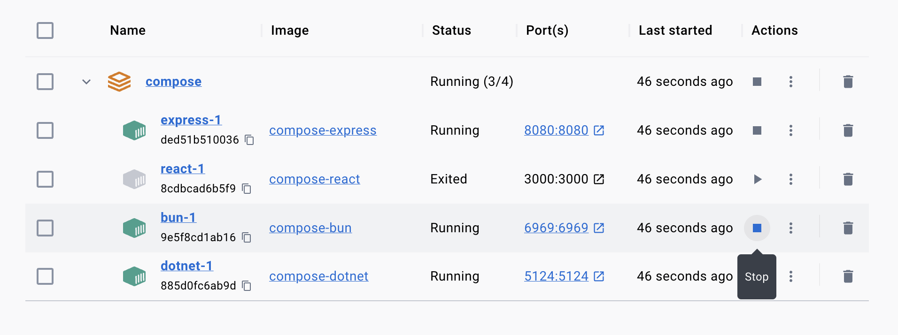

# 🔥 Hot Docker Compose

Wanna do containerized development with hot reloading?  
Here's an approach to get you started.

## 🕸️ Services

Each service lives in a repository of their own:

- [React Frontend](https://github.com/VidunderGunder/docker-react) | TypeScript | Vite
- [DotNet Backend](https://github.com/VidunderGunder/docker-dotnet) | C# | .NET6
- [Express Backend](https://github.com/VidunderGunder/docker-express) | TypeScript | Node
- [Bun Backend](https://github.com/VidunderGunder/docker-bun) | TypeScript | Bun


## 🚀 Getting Started

Install [Docker](https://www.docker.com/)

Clone repos:

```bash
/bash/shell clone-repos.sh
```

Start services:

```bash
docker-compose up
```

Stop services:

```bash
docker-compose down
```

## 🐇 Develop With Docker and Hot Reloading

Start services, and just develop as you normally would

To enable intellisense in VSCode, you can do one of the following:

- Install packages manually on your machine (see each `README.md`)
- ~~Use the [Dev Containers](https://marketplace.visualstudio.com/items?itemName=ms-vscode-remote.remote-containers) extension~~ (WIP)

## 🐌 Develop Locally

For projects that are not setup to support hot module reloading (HMR) with Docker, you can develop locally and rebuild the containers when you are done.

To develop locally, stop the services you want to make changes in:



> Here we're stopping the `react` frontend and the `bun` backend using Docker Desktop

Start the services you want to develop locally in separate terminals:

```bash
# Terminal 1 at ~/docker-bun/
bun i
bun run 
```

```bash
# Terminal 2 at ~/docker-react/
pnpm i
pnpm dev
```

When you are done, stop them locally, before rebuilding and restarting them in Docker Desktop:

```bash
docker-compose up --build
```

Now all services should be up-to-date with your newest changes and running as containers again.
